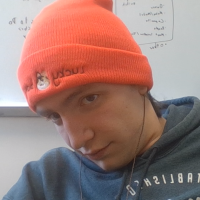

# CarpPool 🐟🚙💨

A ride sharing organization platform

---

## Table of Contents

[About 🤔💭](#about)

[Running 🏃‍♂️💨](#running)

[Project Story 📖✍](#project-story)
- [Inspiration](#inspiration)
- [What it does](#what-it-does)
- [How we built it](#how-we-built-it)
- [Challenges we ran into](#challenges-we-ran-into)
- [Accomplishments that we're proud of](#accomplishments-that-were-proud-of)
- [What we learned](#what-we-learned)
- [What's next for CarpPool](#whats-next-for-carppool)

[Contributors 🦞🦞](#contributors)

---

## About
CarpPool is an application designed to assist and streamline the process of organizing carpool groups. It simplifies determining who's driving who and when are where pick ups take place for car pool arrangements.

The organization process is simplified. To start, all the leader has to do is create an event and share the event code. Anyone with the event code can join the even, volunteer to help drive, or join a car pool group, all without having to worry about making an account.

The trip dashboard displays all the information about car pool arrangements for the event. It also allows for easy modification, so arrangements can be changed if someone comes up. If something comes up, drivers are able to change their status, and if something goes wrong, an event can be deleted all together.

---

## Running 

We are currently hosting the website online! Check it out [here](https://carppool.vercel.app) and maybe even share with your friends.

---

## Project Story

### Inspiration
One of our team members had a recent experience with trying to organize a car pool. His club was trying to get thing organized for a short weekend trip to Atlanta. However, things were anything but smooth. Quickly, the club group chat became a mess of information as people offered to drive, people trying to get a ride with others, figuring out what each car looks like, where everyone needs to be picked it. It all quickly became a mess, especially because people had to keep repeating information. And thus the idea for CarpPool was born.

### What it does
CarpPool creates a simple system to organize carpooling for large groups. Simplicity was a goal to make it an even more compelling option. It starts with the one person making an event. The event creator sets some details like the name, the date, and the description. They also fill out a bit of information about themselves. After that, a group code and user code is given. The group code can be shared with others to join their groups. Joining a group requires the code and filling out some information. After that, users can view the dashboard by entering in the group code and their user code. All the relevant information is displayed, everything from who is in what car, when and where people are getting picked up, and when its time to leave. They also can sign up to drive, join cars, or even change information about themselves, their vehicles, and the even if they are the owner. 

### How we built it
CarpPool was built with various different tools to create a cohesive experience for all users. The front end was made with Node.js to create a wonderful user experience with a quick and speedy connection to the database. Spring Boot was also utilized to create a responsive RESTful back end API for extra functionality and secure database access.

### Challenges we ran into
This was our first time working on a project of this scale. Most of our previous projects have never had such a clear separation between front end and back end, so figuring out how to design and integrate the two halves was a great challenge. With much perseverance, we were able to design and make something that works nearly flawlessly. Another issue we had trouble with was the deletion of items from our database. It was difficult to ensure these changes were not only carried out, but also to make sure deletion did not have any negative effects on the other interconnected parts of the application.

### Accomplishments that we're proud of
Finishing this project was incredibly rewarding. Seeing our plans come to life was amazing. We were able to completely fulfill our vision within the time we have, and it also exists as a great jumping off point for further development. Regardless of if we continue to work on it or not, it remains a project to be proud of.

### What we learned
Everyone learned a lot from this project. One of the biggest take-aways was properly implementing a back end and database and making it work with the front end. It was quite the challenge to integrate the two parts together, but we figured it out and can take this knowledge into our future projects.

### What's next for CarpPool
We plan to expand the functionality by increasing the browser support and accessibility. As of right now, the website currently only functions correctly on desktop, however we know that most people would want to use their phone for an application like this. Creating a more mobile friendly website or even a separate mobile version is next on our list.

CarpPool was named as such because we love bad puns and fishing. 

---

## Contributors

|  |  |  |
|---|---|---|
| [Bret Jones](https://github.com/Iceman013) | [Graham Tokarz](https://github.com/Monkeytoes999) | [Simon Daugherty](https://github.com/simondaug) |
| Front End | Database | Back End

🦞 🦞 🦞 🦞 🦞 🦞 🦞

